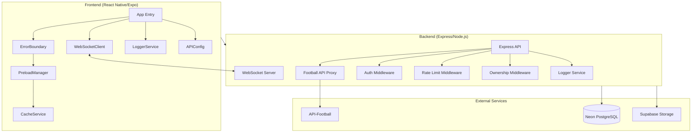

# Design Document

## Overview

This design document outlines the technical approach for implementing security fixes, performance optimizations, and UX improvements for the 90Plus football application. The system uses React Native (Expo) for the frontend and Node.js/Express with Prisma ORM for the backend, connected to a PostgreSQL database (Neon).

The implementation focuses on:
1. **Security**: Moving API keys to backend, securing .env.example, adding file deletion authorization
2. **Performance**: Background data preloading, video preloading, optimistic updates
3. **Rate Limiting**: Enforcing cooldowns for profile changes, video uploads, and deletions
4. **Real-time**: WebSocket integration for instant updates
5. **Code Quality**: Logger service, centralized API config, TypeScript improvements, ErrorBoundary

## Architecture



## Components and Interfaces

### 1. Football API Proxy (Backend)

```typescript
// Backend/src/controllers/football.controller.ts
interface FootballProxyController {
  getLeagues(req: Request, res: Response): Promise<void>;
  getFixtures(req: Request, res: Response): Promise<void>;
  getLiveFixtures(req: Request, res: Response): Promise<void>;
  getFixtureById(req: Request, res: Response): Promise<void>;
  getStandings(req: Request, res: Response): Promise<void>;
  getHeadToHead(req: Request, res: Response): Promise<void>;
}

// Backend/src/services/football.service.ts
interface FootballService {
  fetchFromApi<T>(endpoint: string, params: Record<string, any>): Promise<T>;
}
```

### 2. Logger Service

```typescript
// Shared logger interface
interface Logger {
  debug(message: string, ...args: any[]): void;
  info(message: string, ...args: any[]): void;
  warn(message: string, ...args: any[]): void;
  error(message: string, ...args: any[]): void;
}

// Configuration
interface LoggerConfig {
  level: 'debug' | 'info' | 'warn' | 'error';
  enableTimestamp: boolean;
  enableInProduction: boolean;
}
```

### 3. Preload Manager (Frontend)

```typescript
// front/services/preloadManager.ts
interface PreloadManager {
  initialize(): Promise<void>;
  preloadScreen(screen: ScreenName): Promise<void>;
  preloadReels(count: number): Promise<void>;
  getPreloadedData<T>(key: string): T | null;
  invalidate(key: string): void;
}

type ScreenName = 'profile' | 'reels' | 'notifications' | 'matches';

interface PreloadConfig {
  screens: ScreenName[];
  reelsCount: number;
  refreshInterval: number;
}
```

### 4. WebSocket Client (Frontend)

```typescript
// front/services/websocketClient.ts
interface WebSocketClient {
  connect(): void;
  disconnect(): void;
  subscribe(event: WSEventType, callback: (data: any) => void): () => void;
  send(event: WSEventType, data: any): void;
  isConnected(): boolean;
}

type WSEventType = 
  | 'notification'
  | 'comment'
  | 'reply'
  | 'like'
  | 'follow'
  | 'match_update'
  | 'reel_update';

interface WSMessage {
  type: WSEventType;
  payload: any;
  timestamp: number;
}
```

### 5. WebSocket Server (Backend)

```typescript
// Backend/src/services/websocket.service.ts
interface WebSocketService {
  initialize(server: http.Server): void;
  broadcast(event: WSEventType, data: any): void;
  sendToUser(userId: string, event: WSEventType, data: any): void;
  sendToRoom(room: string, event: WSEventType, data: any): void;
}
```

### 6. Ownership Middleware (Backend)

```typescript
// Backend/src/middleware/ownership.middleware.ts
interface OwnershipMiddleware {
  verifyFileOwnership(req: Request, res: Response, next: NextFunction): Promise<void>;
}
```

### 7. API Configuration (Frontend)

```typescript
// front/config/api.config.ts
interface APIConfig {
  baseUrl: string;
  wsUrl: string;
  timeout: number;
  retryAttempts: number;
}

type Environment = 'development' | 'staging' | 'production';
```

### 8. ErrorBoundary (Frontend)

```typescript
// front/components/ErrorBoundary.tsx
interface ErrorBoundaryProps {
  children: React.ReactNode;
  fallback?: React.ReactNode;
  onError?: (error: Error, errorInfo: React.ErrorInfo) => void;
}

interface ErrorBoundaryState {
  hasError: boolean;
  error: Error | null;
}
```

## Data Models

### Updated Prisma Schema Additions

```prisma
// No new models needed - using existing User model fields:
// - lastAvatarChange: DateTime?
// - lastCoverChange: DateTime?
// - lastUsernameChange: DateTime?
// - lastReelUpload: DateTime?
// - reelDeleteCount: Int @default(0)
```

### Rate Limit Configuration

```typescript
interface RateLimitConfig {
  avatar: { cooldownDays: 7 };
  cover: { cooldownDays: 15 };
  username: { cooldownDays: 15 };
  reelUpload: { cooldownDays: 3 };
  reelDelete: { maxDeletes: 2 };
  commentsPerReel: { maxCount: 5 };
  repliesPerReel: { maxCount: 5 };
}
```

### WebSocket Event Payloads

```typescript
interface NotificationPayload {
  id: string;
  type: NotificationType;
  title: string;
  message: string;
  data?: Record<string, any>;
}

interface CommentPayload {
  reelId: string;
  comment: {
    id: string;
    content: string;
    user: { id: string; username: string; avatar?: string };
    createdAt: string;
  };
}

interface FollowPayload {
  followerId: string;
  followingId: string;
  action: 'follow' | 'unfollow';
}

interface MatchUpdatePayload {
  matchId: number;
  homeScore: number;
  awayScore: number;
  status: string;
  minute?: number;
}
```


## Correctness Properties

*A property is a characteristic or behavior that should hold true across all valid executions of a system-essentially, a formal statement about what the system should do. Properties serve as the bridge between human-readable specifications and machine-verifiable correctness guarantees.*

### Property 1: Football API Proxy Response Validity
*For any* valid request to the football proxy endpoint, the response structure SHALL match the expected API-Football response schema.
**Validates: Requirements 1.1, 1.4**

### Property 2: File Deletion Authorization
*For any* file deletion request where the requesting user ID does not match the file owner ID, the system SHALL return a 403 Forbidden response.
**Validates: Requirements 3.1, 3.2**

### Property 3: File Path Owner Extraction
*For any* valid file path in the format `{userId}/{filename}`, the system SHALL correctly extract and return the owner ID.
**Validates: Requirements 3.4**

### Property 4: Logger Environment Behavior
*For any* log message at debug level, when the environment is production, the logger SHALL suppress the output; when the environment is development, the logger SHALL output the message.
**Validates: Requirements 4.1, 4.2**

### Property 5: Logger Message Format
*For any* log message created by the logger service, the output SHALL contain a timestamp and log level indicator.
**Validates: Requirements 4.3**

### Property 6: API Configuration Environment URLs
*For any* environment (development, staging, production), the API configuration SHALL return a valid, non-empty URL specific to that environment.
**Validates: Requirements 5.2, 5.4**

### Property 7: ErrorBoundary Error Catching
*For any* JavaScript error thrown within an ErrorBoundary's children, the ErrorBoundary SHALL catch the error and render the fallback UI instead of crashing.
**Validates: Requirements 7.1, 7.2, 7.3**

### Property 8: Preloaded Data Immediate Display
*For any* screen with preloaded data in cache, navigating to that screen SHALL display the cached data immediately without showing a loading indicator.
**Validates: Requirements 8.3, 8.4**

### Property 9: Video Duration Display Format
*For any* video with a known duration under one hour, the displayed duration SHALL be formatted as MM:SS; for unknown duration, the duration indicator SHALL be hidden.
**Validates: Requirements 9.1, 9.3, 9.4**

### Property 10: Avatar Change Cooldown Enforcement
*For any* avatar change request within 7 days of the last change, the system SHALL reject the request and return the remaining days in the response.
**Validates: Requirements 10.2, 10.3**

### Property 11: Cover Change Cooldown Enforcement
*For any* cover photo change request within 15 days of the last change, the system SHALL reject the request and return the remaining days in the response.
**Validates: Requirements 11.2, 11.3**

### Property 12: Username Change Cooldown Enforcement
*For any* username change request within 15 days of the last change, the system SHALL reject the request and return the remaining days in the response.
**Validates: Requirements 12.2, 12.3**

### Property 13: Cooldown Persistence Across Sessions
*For any* cooldown (avatar, cover, username), logging out and back in SHALL NOT reset the cooldown; the remaining time SHALL be calculated from the stored timestamp.
**Validates: Requirements 10.5, 11.5, 12.5**

### Property 14: Video Upload Cooldown Enforcement
*For any* video upload request within 3 days of the last upload, the system SHALL reject the request and return the remaining hours in the response.
**Validates: Requirements 13.2, 13.3**

### Property 15: Video Delete Limit Enforcement
*For any* user who has deleted 2 videos, the third deletion attempt SHALL be blocked with an appropriate error message.
**Validates: Requirements 13.5, 13.6**

### Property 16: Video Delete Resets Upload Cooldown
*For any* video deletion (within the 2-delete limit), the upload cooldown SHALL be reset, allowing immediate upload.
**Validates: Requirements 13.4**

### Property 17: Comment Limit Per User Per Reel
*For any* user who has posted 5 comments (including replies) on a reel, additional comment attempts SHALL be rejected with a limit reached message.
**Validates: Requirements 15.1, 15.2, 15.3**

### Property 18: Reply Optimistic Update
*For any* reply submission, the reply SHALL appear in the UI immediately before backend confirmation.
**Validates: Requirements 14.3**

### Property 19: Audio Cleanup on Navigation
*For any* navigation away from the reels page, all video audio SHALL be stopped immediately.
**Validates: Requirements 16.1**

### Property 20: Video Replay Limit
*For any* video that has auto-replayed twice, the video SHALL pause and display a replay button; manual tap SHALL restart playback.
**Validates: Requirements 17.1, 17.2, 17.3**

### Property 21: Replay Count Reset on Scroll
*For any* video, scrolling away and back SHALL reset the replay count to zero.
**Validates: Requirements 17.4**

### Property 22: Follow Button Visibility
*For any* reel, if the viewer is the reel owner, the follow button SHALL be hidden; otherwise, it SHALL be visible.
**Validates: Requirements 18.1, 18.2**

### Property 23: Follow Optimistic Update with Background Sync
*For any* follow/unfollow action, the UI SHALL update immediately, and the backend SHALL be notified in the background.
**Validates: Requirements 18.3, 18.4, 18.5**

### Property 24: Reel Preloading Ahead
*For any* reel being viewed, the system SHALL have the next 2-3 reels preloaded and ready to play without buffering.
**Validates: Requirements 19.2, 19.3**

### Property 25: Optimistic Update with Retry
*For any* user action with optimistic update, if backend sync fails, the system SHALL retry before showing an error.
**Validates: Requirements 20.1, 20.2, 20.3**

### Property 26: WebSocket Event Delivery
*For any* event (notification, comment, reply, like, follow, match update), the WebSocket SHALL deliver the event to the appropriate connected clients within a reasonable time.
**Validates: Requirements 21.2, 21.3, 21.4, 21.5, 21.8, 21.9**

### Property 27: WebSocket Reconnection with Backoff
*For any* WebSocket disconnection, the client SHALL attempt reconnection with exponential backoff and sync missed events upon successful reconnection.
**Validates: Requirements 21.6, 21.7**

## Error Handling

### Backend Error Responses

```typescript
interface ErrorResponse {
  status: 'ERROR';
  message: string;
  code?: string;
  details?: Record<string, any>;
}

// Standard error codes
const ERROR_CODES = {
  UNAUTHORIZED: 'UNAUTHORIZED',
  FORBIDDEN: 'FORBIDDEN',
  NOT_FOUND: 'NOT_FOUND',
  RATE_LIMITED: 'RATE_LIMITED',
  COOLDOWN_ACTIVE: 'COOLDOWN_ACTIVE',
  LIMIT_REACHED: 'LIMIT_REACHED',
  VALIDATION_ERROR: 'VALIDATION_ERROR',
  INTERNAL_ERROR: 'INTERNAL_ERROR',
};
```

### Frontend Error Handling

```typescript
// Optimistic update rollback
interface OptimisticAction<T> {
  optimisticData: T;
  rollback: () => void;
  confirm: () => Promise<void>;
}

// Retry configuration
interface RetryConfig {
  maxAttempts: number;
  baseDelay: number;
  maxDelay: number;
  backoffMultiplier: number;
}
```

### WebSocket Error Handling

```typescript
interface WSErrorHandler {
  onConnectionError: (error: Error) => void;
  onMessageError: (error: Error, message: WSMessage) => void;
  onReconnectFailed: (attempts: number) => void;
}
```

## Testing Strategy

### Dual Testing Approach

This implementation uses both unit tests and property-based tests:

1. **Unit Tests**: Verify specific examples, edge cases, and integration points
2. **Property-Based Tests**: Verify universal properties that should hold across all inputs

### Property-Based Testing Library

- **Backend**: Using `fast-check` for Node.js/TypeScript
- **Frontend**: Using `fast-check` with React Native testing utilities

### Test Configuration

```typescript
// Property test configuration
const PBT_CONFIG = {
  numRuns: 100,  // Minimum 100 iterations per property
  seed: undefined,  // Random seed for reproducibility when debugging
};
```

### Test Categories

1. **Security Tests**
   - API key not exposed in frontend code
   - File ownership verification
   - Authorization middleware

2. **Rate Limiting Tests**
   - Cooldown enforcement for all resources
   - Cooldown persistence across sessions
   - Delete limit enforcement

3. **Real-time Tests**
   - WebSocket connection and reconnection
   - Event delivery to correct clients
   - Optimistic update rollback

4. **Performance Tests**
   - Preloading behavior
   - Cache hit rates
   - Background sync timing

### Test File Structure

```
Backend/src/__tests__/
├── football-proxy.property.ts
├── file-ownership.property.ts
├── cooldown.property.ts
├── comment-limit.property.ts
├── websocket.property.ts
└── logger.property.ts

front/__tests__/
├── preload-manager.property.ts
├── error-boundary.property.ts
├── video-replay.property.ts
├── follow-button.property.ts
└── optimistic-update.property.ts
```
