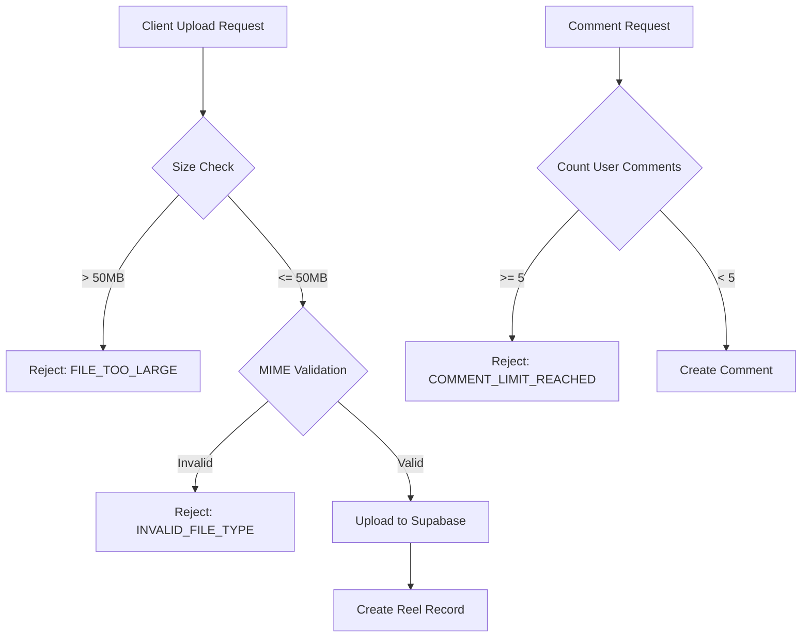

# Design Document: Video Upload Security & Comment Limiting

## Overview

هذا التصميم يوضح كيفية تنفيذ ثلاث ميزات أمان للريلز:
1. **Hard Size Limit** - حد صارم 50MB لحجم الفيديوهات
2. **MIME Type Verification** - التحقق من نوع الملف عبر magic bytes
3. **Comment Rate Limiting** - 5 تعليقات كحد أقصى لكل مستخدم على كل فيديو

## Architecture



## Components and Interfaces

### 1. File Validation Middleware

```typescript
// Backend/src/middleware/file-validation.middleware.ts

interface ValidationResult {
  valid: boolean;
  error?: string;
  errorCode?: 'FILE_TOO_LARGE' | 'INVALID_FILE_TYPE';
}

interface MimeSignature {
  bytes: number[];
  mimeType: string;
}
```

### 2. Updated Upload Middleware

```typescript
// Backend/src/middleware/upload.middleware.ts
// تحديث الـ multer config مع الحد الجديد
```

### 3. Comment Controller Update

```typescript
// Backend/src/controllers/comment.controller.ts
// إضافة فحص عدد التعليقات قبل الإنشاء
```

## Data Models

### Constants Configuration

```typescript
// Backend/src/config/supabase.config.ts

export const FILE_SIZE_LIMITS = {
  AVATAR: 5 * 1024 * 1024,      // 5MB
  REEL: 50 * 1024 * 1024,       // 50MB (Hard Limit)
  THUMBNAIL: 2 * 1024 * 1024,   // 2MB
} as const;

export const COMMENT_LIMITS = {
  MAX_PER_USER_PER_REEL: 5,
} as const;
```

### Magic Bytes Signatures

```typescript
const VIDEO_SIGNATURES: MimeSignature[] = [
  // MP4 (ftyp)
  { bytes: [0x00, 0x00, 0x00, null, 0x66, 0x74, 0x79, 0x70], mimeType: 'video/mp4' },
  // WebM
  { bytes: [0x1A, 0x45, 0xDF, 0xA3], mimeType: 'video/webm' },
  // QuickTime (moov)
  { bytes: [0x00, 0x00, 0x00, null, 0x6D, 0x6F, 0x6F, 0x76], mimeType: 'video/quicktime' },
  // QuickTime (free)
  { bytes: [0x00, 0x00, 0x00, null, 0x66, 0x72, 0x65, 0x65], mimeType: 'video/quicktime' },
];
```

## Correctness Properties

*A property is a characteristic or behavior that should hold true across all valid executions of a system-essentially, a formal statement about what the system should do. Properties serve as the bridge between human-readable specifications and machine-verifiable correctness guarantees.*

### Property 1: Size Limit Enforcement
*For any* file buffer with size greater than 50MB, the validation function SHALL return `{ valid: false, errorCode: 'FILE_TOO_LARGE' }` and no data SHALL be stored.
**Validates: Requirements 1.2, 1.4**

### Property 2: Valid Video MIME Acceptance
*For any* file buffer that starts with valid video magic bytes (MP4 ftyp, WebM, QuickTime), the MIME validator SHALL return `{ valid: true }` when the declared Content-Type matches.
**Validates: Requirements 2.2**

### Property 3: Invalid MIME Rejection
*For any* file buffer that does not start with valid video magic bytes, the MIME validator SHALL return `{ valid: false, errorCode: 'INVALID_FILE_TYPE' }`.
**Validates: Requirements 2.3**

### Property 4: MIME Mismatch Rejection
*For any* file buffer where the detected MIME type from magic bytes differs from the declared Content-Type, the validator SHALL reject the file.
**Validates: Requirements 2.4**

### Property 5: Comment Limit Boundary
*For any* user and reel combination, if the user has fewer than 5 comments (including replies) on that reel, adding a new comment SHALL succeed. If the user has 5 or more comments, adding a new comment SHALL fail with error code "COMMENT_LIMIT_REACHED".
**Validates: Requirements 3.2, 3.3, 3.5**

## Error Handling

### Error Codes and Messages

| Error Code | HTTP Status | Arabic Message |
|------------|-------------|----------------|
| FILE_TOO_LARGE | 413 | الملف كبير جداً. الحد الأقصى 50 ميجابايت |
| INVALID_FILE_TYPE | 415 | نوع الملف غير مسموح. يُسمح فقط بملفات الفيديو (MP4, WebM, MOV) |
| COMMENT_LIMIT_REACHED | 429 | وصلت للحد الأقصى من التعليقات (5) على هذا الفيديو |

### Error Response Format

```typescript
interface ErrorResponse {
  status: 'ERROR';
  code: string;
  message: string;
  details?: {
    maxSize?: number;
    currentSize?: number;
    allowedTypes?: string[];
    maxComments?: number;
    currentComments?: number;
  };
}
```

## Testing Strategy

### Property-Based Testing

سنستخدم مكتبة **fast-check** للـ property-based testing في TypeScript.

كل property test يجب أن:
- يشغل 100 iteration على الأقل
- يحتوي على تعليق يربطه بالـ correctness property في هذا المستند

### Unit Tests

- اختبار حالات الحدود (49.9MB, 50MB, 50.1MB)
- اختبار كل نوع من أنواع الفيديو المسموحة
- اختبار التعليق رقم 5 و 6

### Test Files Structure

```
Backend/src/__tests__/
├── file-validation.test.ts      # Size & MIME validation tests
├── file-validation.property.ts  # Property-based tests for validation
├── comment-limit.test.ts        # Comment limiting tests
└── comment-limit.property.ts    # Property-based tests for comments
```

