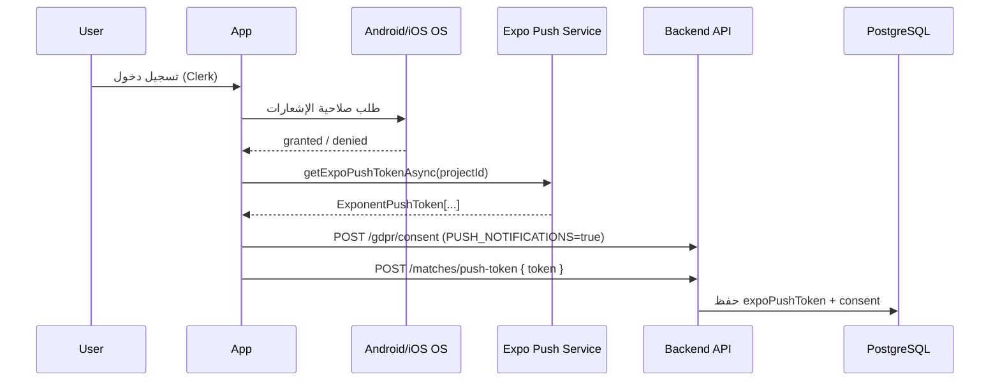
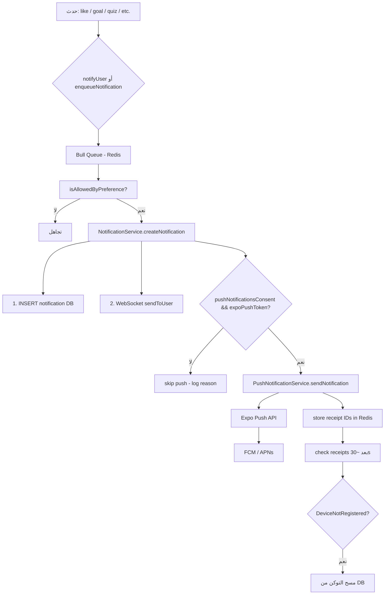
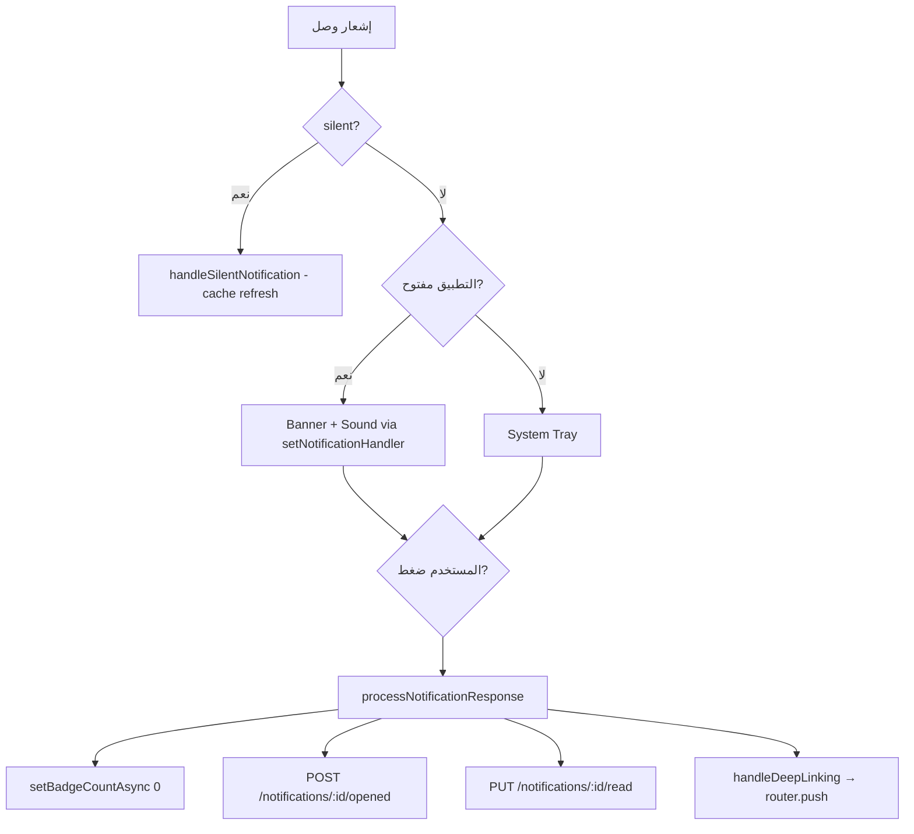

# توثيق فلو الإشعارات — تطبيق 90Plus (Android + iOS)

هذا المستند يشرح **الفلو الكامل** من جهاز المستخدم حتى الـ Backend وعودة الإشعار، مع الفروقات بين Android و iOS. مبني على الكود الحالي في المشروع.

---

## 1. نظرة عامة على المعمارية

التطبيق يستخدم **Expo Push Notifications** كطبقة موحّدة:

| الطبقة | التقنية |
|--------|---------|
| Mobile | `expo-notifications` |
| Token | `ExponentPushToken[...]` |
| Backend | `expo-server-sdk` → Expo Push API |
| Android delivery | **FCM** (عبر `google-services.json`) |
| iOS delivery | **APNs** (عبر Expo / Apple credentials في EAS) |

```
[حدث في السيرفر] → NotificationService / notifyUser
        ↓
  حفظ في DB + WebSocket (real-time)
        ↓
  Expo Push API → FCM (Android) / APNs (iOS)
        ↓
  الجهاز → معالجة foreground / background / killed
        ↓
  Deep link → شاشة مناسبة في التطبيق
```

**مهم:** الإشعارات البعيدة (Remote Push) **لا تعمل في Expo Go**. لازم **EAS Development Build** أو **Production Build** على جهاز حقيقي.

---

## 2. متطلبات التشغيل

| الشرط | Android | iOS |
|--------|---------|-----|
| جهاز حقيقي | ✅ مطلوب | ✅ مطلوب |
| Expo Go | ❌ لا يدعم push | ❌ لا يدعم push |
| EAS Build | ✅ | ✅ |
| صلاحية OS | `POST_NOTIFICATIONS` (Android 13+) | User Notifications |
| ملفات إعداد | `google-services.json` في `front/` | APNs key/cert في Expo Dashboard |
| EAS Project ID | `17b8b105-8756-4a9b-a2ff-b7a831eb946b` | نفس الـ ID |

إعدادات `front/app.json`:

- **iOS:** `UIBackgroundModes: ["remote-notification"]`
- **Android:** `POST_NOTIFICATIONS`, plugin `expo-notifications` مع `googleServicesFile`
- **Bundle ID / Package:** `com.mhmdsh1892.ninetyplusapp`

---

## 3. الملفات الأساسية (مرجع للمطور)

### Frontend

| الملف | الدور |
|-------|-------|
| `front/services/pushTokenRegistration.service.ts` | تسجيل التوكن، الصلاحيات، قنوات Android |
| `front/src/hooks/usePushNotifications.tsx` | Listeners، deep linking، cold start |
| `front/components/common/PushTokenSyncBootstrap.tsx` | Sync بعد login + foreground + prompt على Android |
| `front/services/notificationForegroundSetup.ts` | عرض الإشعار أثناء فتح التطبيق |
| `front/services/trayNotification.service.ts` | إشعارات محلية من WebSocket |
| `front/services/reelUploadNotification.ts` | إشعارات رفع الفيديو (محلية) |
| `front/app/_layout.tsx` | mount لـ `PushNotificationSetup`, `PushTokenSyncBootstrap`, `GlobalNotificationTrayBridge` |
| `front/contexts/SettingsContext.tsx` | toggle الإشعارات من الإعدادات |
| `front/components/common/NotificationPermissionModal.tsx` | Modal طلب الصلاحية (iOS فقط) |

### Backend

| الملف | الدور |
|-------|-------|
| `src/services/push-notification.service.ts` | إرسال عبر Expo SDK + receipts |
| `src/services/notification.service.ts` | DB + WebSocket + Push |
| `src/services/notify.service.ts` | بوابة موحّدة + preferences + idempotency |
| `src/queues/notification.queue.ts` | Bull queue للإشعارات |
| `src/services/match-events/match-event-push.processor.ts` | push أحداث المباريات الحية |
| `src/routes/matches.routes.ts` | `POST/GET /matches/push-token` |
| `src/routes/notification.routes.ts` | inbox, preferences, match-subscribe |

### Database (Prisma)

- `User.expoPushToken` — توكن الجهاز
- `User.pushNotificationsConsent` — موافقة GDPR على الإشعارات
- `Notification` — صندوق الإشعارات داخل التطبيق
- `NotificationPreferences` — تفضيلات حسب النوع
- `FavoriteMatch` — اشتراكات المباريات (جرس المباراة)

---

## 4. فلو تسجيل التوكن (مشترك + فروقات المنصة)



### الخطوات بالتفصيل

1. **`PushTokenSyncBootstrap`** يشتغل بعد `isLoaded && isSignedIn`
2. **`ensureAndroidNotificationChannels()`** — إنشاء قنوات Android (شرط لـ Android 13+ قبل الـ prompt)
3. **`getExpoPushTokenAsync({ projectId })`** — الحصول على التوكن
4. **`POST /api/gdpr/consent`** — `consentType: PUSH_NOTIFICATIONS`
5. **`POST /api/matches/push-token`** — حفظ التوكن في DB
6. **`GET /api/matches/push-token/status?token=...`** — تحقق قبل إعادة الإرسال (تجنب duplicate POST)

### Retry / Pending Token

- لو المستخدم منح الصلاحية قبل تسجيل الدخول → التوكن يُحفظ في AsyncStorage: `@90plus/pendingExpoPushToken`
- بعد Login → `flushPendingPushToken()` يرسله للـ Backend
- Retry مع exponential backoff (3 محاولات) + Sentry على الفشل
- مفتاح "سُئلنا مرة": `notification_permission_requested_v3`

### Backend: POST /api/matches/push-token

- يتحقق من صيغة التوكن عبر `Expo.isExpoPushToken()`
- يمسح التوكن من أي مستخدم آخر يملكه (جهاز واحد = مستخدم واحد)
- يحدّث `expoPushToken` + `pushNotificationsConsent: true`
- يرجع `USER_NOT_SYNCED` لو صف المستخدم غير موجود بعد في DB

---

## 5. فلو Android — بالتفصيل

### 5.1 طلب الصلاحية

| الخطوة | التفاصيل |
|--------|----------|
| من يطلب؟ | `PushTokenSyncBootstrap.ensureAndroidNotificationPermission()` |
| متى؟ | بعد login بـ ~2.5 ثانية (انتظار mount الشاشة الرئيسية) |
| نوع الـ dialog | **System dialog** مباشرة (ليس modal داخل التطبيق) |
| شرط مسبق | إنشاء notification channels أولاً |
| مرة واحدة | `notification_permission_requested_v3` في AsyncStorage |

**ملاحظة مهمة:** على Android، الحالة الأولية قد تكون `denied` وليس `undetermined` — الكود يعامل الاثنين كـ "يجب السؤال".

```typescript
// shouldPromptForNotificationPermission (pushTokenRegistration.service.ts)
// Android: undetermined OR denied → prompt
// iOS: undetermined فقط
```

### 5.2 قنوات الإشعارات (Notification Channels)

| Channel ID | الاسم | الأهمية | الاستخدام |
|------------|-------|---------|-----------|
| `default` | إشعارات عامة | MAX | افتراضي |
| `match-updates` | تحديثات المباريات | MAX | أهداف، بداية/نهاية مباراة |
| `social` | تفاعلات اجتماعية | HIGH | like, comment, follow |
| `general` | إشعارات التطبيق | DEFAULT | quiz, wheel, gifts |
| `reel-upload` | (محلي) | — | تقدم رفع الفيديو |
| `reel-upload-result` | (محلي) | — | نجاح/فشل الرفع |

الـ Backend يحدد `channelId` في payload الـ Expo push، والـ Frontend ينشئ القنوات عند أول استخدام.

### 5.3 FCM

Plugin في `front/app.json`:

```json
["expo-notifications", {
  "icon": "./assets/images/90Plus.png",
  "color": "#22c55e",
  "defaultChannel": "default",
  "googleServicesFile": "./google-services.json"
}]
```

أخطاء `MismatchSenderId` / `InvalidCredentials` → مشكلة FCM V1 في Expo Dashboard.

### 5.4 حالات التطبيق على Android

| الحالة | السلوك |
|--------|--------|
| Foreground | `setNotificationHandler` يعرض banner + sound + badge |
| Background | إشعار في system tray |
| Killed | `getLastNotificationResponseAsync()` عند cold start |
| App → Active | `syncExpoPushTokenIfGranted()` + `setBadgeCountAsync(0)` |

### 5.5 تفعيل من الإعدادات

Settings → `toggleNotifications(true)` في `SettingsContext`:

1. `ensureAndroidNotificationChannels()`
2. `requestOsNotificationPermission()`
3. `updatePushNotificationsConsent(true)`
4. `syncExpoPushToken()`

عند الإيقاف: `cancelAllScheduledNotificationsAsync()` + `consent=false`

---

## 6. فلو iOS — بالتفصيل

### 6.1 طلب الصلاحية

| الخطوة | التفاصيل |
|--------|----------|
| UX | **Modal داخل التطبيق** (`NotificationPermissionModal`) ثم system dialog |
| من يعرض الـ Modal؟ | `PushNotificationSetup` (iOS فقط — `Platform.OS === 'ios'`) |
| متى؟ | بعد login بـ ~1.5–2.5 ثانية، مرة واحدة |
| على Confirm | `requestOsNotificationPermission()` → system iOS prompt |

**Android لا يستخدم الـ Modal** — يستخدم system dialog مباشرة من `PushTokenSyncBootstrap`.

### 6.2 إعدادات iOS

- `UIBackgroundModes: remote-notification` — لاستقبال push في الخلفية
- `NSUserNotificationsUsageDescription` — نص طلب الصلاحية
- APNs credentials مُعدّة في Expo/EAS (ليس في الكود)

### 6.3 iOS-specific behaviors

| الميزة | التفاصيل |
|--------|----------|
| `threadId` | تجميع إشعارات متعلقة (يُرسل من Backend لبعض الأنواع) |
| Silent push | `_contentAvailable: true` + `badge: 0` + بدون title/body |
| Badge | يُصفّر عند فتح التطبيق أو الضغط على إشعار |
| Permission denied | المستخدم يذهب لـ Settings → 90Plus → Notifications |

### 6.4 حالات التطبيق على iOS

نفس Android من ناحية listeners:

- `addNotificationReceivedListener` — foreground
- `addNotificationResponseReceivedListener` — tap
- `getLastNotificationResponseAsync` — cold start

---

## 7. فلو الإرسال من الـ Backend



### شروط إرسال Push

1. `User.pushNotificationsConsent === true`
2. `User.expoPushToken` موجود وصالح
3. النوع مسموح في `NotificationPreferences` (ما عدا RE_ENGAGEMENT, MODERATION_ALERT, GENERAL الحرجة)
4. المستخدم غير محذوف / غير محظور

### Payload الـ Push (مثال)

```json
{
  "to": "ExponentPushToken[xxxx]",
  "title": "⚽ هدف!",
  "body": "الأهلي 1 - 0 الزمالك",
  "sound": "default",
  "priority": "high",
  "channelId": "match-updates",
  "data": {
    "type": "MATCH_GOAL",
    "matchId": "12345",
    "fixtureId": "12345",
    "notificationId": "uuid-from-db"
  }
}
```

### معالجة أخطاء Expo (Backend)

| Error Code | الإجراء |
|------------|---------|
| `DeviceNotRegistered` | مسح التوكن من DB |
| `InvalidRegistration` | مسح التوكن من DB |
| `MessageRateExceeded` | retry |
| `InvalidCredentials` / `MismatchSenderId` | Sentry fatal — فحص FCM/APNs في Expo |
| `MessageTooBig` | تقليل حجم payload |

---

## 8. أنواع الإشعارات

### 8.1 إشعارات المباريات (Match Events)

- المستخدم يشترك عبر **جرس المباراة** → `POST /api/notifications/match-subscribe`
- يُحفظ في `FavoriteMatch` + Bull job عند `matchDate` لإشعار «المباراة بدأت» (`match-start-reminder.queue`؛ multi-device + `notifiedStart` يمنع التكرار مع مسار الحالة)
- أحداث live (هدف، بطاقة، نهاية...) من تغيّر النتيجة/الحالة (+ أحداث API إن وُجدت) → fan-out فوري
- دوريات بدون feed أحداث: بداية/أهداف/نهاية عبر status+score؛ لا بطاقات/VAR
- Preferences: `matchGoals`, `matchStart`, `matchEnd`, `matchHalftime`, `matchCards`, `leagueMatches`, إلخ

### 8.2 إشعارات اجتماعية

- LIKE, COMMENT, REPLY, MENTION, FOLLOW, SHARE, COMMENT_LIKE
- Channel: `social`
- Deep link → reels مع comments أو profile

### 8.3 إشعارات النظام / المكافآت

- LUCKY_WHEEL, LUCKY_WHEEL_RENEWED, DAILY_QUIZ_RENEWED, QUIZ_REWARD
- COOLDOWN_EXPIRED, LEVEL_UP, GIFT, COIN_MILESTONE, VIDEO_PROCESSED
- LEADERBOARD_TOP10, LEADERBOARD_TOP3, AI_CHECKIN, RE_ENGAGEMENT
- Channel: `general` (أو `match-updates` لأحداث المباريات)

### 8.4 Silent Push (بدون UI)

```typescript
// Backend: PushNotificationService.sendSilentNotification
// data: { type: 'MATCH_UPDATE' | 'SCORE_UPDATE' | 'NOTIFICATION_COUNT', silent: true }
```

**Frontend handling** (`usePushNotifications.tsx` → `handleSilentNotification`):

- `MATCH_UPDATE` / `SCORE_UPDATE` → تحديث `liveFixtureStore` بدون إظهار banner
- `LIKE`, `COMMENT`, `REPLY`, `MENTION`, `SHARE`, `COMMENT_LIKE`, `NOTIFICATION_COUNT` → invalidate unread count فقط

---

## 9. فلو استقبال الإشعار على الجهاز



### Foreground handler

`front/services/notificationForegroundSetup.ts` يضبط:

```typescript
Notifications.setNotificationHandler({
  handleNotification: async () => ({
    shouldShowAlert: true,
    shouldPlaySound: true,
    shouldSetBadge: true,
    shouldShowBanner: true,
    shouldShowList: true,
  }),
});
```

بدون `shouldShowBanner` / `shouldShowList` قد لا تظهر الإشعارات أثناء فتح التطبيق.

### Deep Linking (حسب `data.type`)

| النوع | الوجهة |
|-------|--------|
| `MATCH_GOAL`, `MATCH_UPDATE`, `MATCH_START`, `MATCH_END`, `MATCH_HALFTIME`, `MATCH_*` | `/(tabs)/match-details?fixtureId=` |
| `FOLLOW` | `/user/[username]` |
| `LIKE`, `COMMENT`, `REPLY`, `MENTION`, `SHARE`, `COMMENT_LIKE` | `/(tabs)/reels` (+ `commentId` إن وُجد) |
| `LUCKY_WHEEL`, `LUCKY_WHEEL_RENEWED` | Home + `openLuckyWheel=true` |
| `VIDEO_PROCESSED` | reels |
| `GIFT`, `COIN_MILESTONE` | profile → wallet |
| `LEVEL_UP` | profile → stats |
| `AI_CHECKIN` | chat |
| `DAILY_QUIZ_RENEWED`, `QUIZ_REWARD` | quiz |
| `LEADERBOARD_TOP10`, `LEADERBOARD_TOP3` | rank |
| `PREDICTION_RESULT` | match-details |
| `COOLDOWN_EXPIRED`, `AVATAR_UPLOAD` | profile |
| `MILESTONE`, `REPORT_*` | `data.screen` أو `/notifications` |
| default | `/notifications` |

---

## 10. WebSocket + Tray Notifications (Fallback)

عند فتح التطبيق والاتصال بـ WebSocket:

1. Backend يرسل `notification` event عبر `WebSocketService.sendToUser`
2. **`GlobalNotificationTrayBridge`** يستمع ويستدعي `presentTrayNotification()`
3. يعرض **إشعار محلي** (`scheduleNotificationAsync` مع `trigger: null`)
4. Dedup: نفس `notificationId` خلال 8 ثوانٍ لا يُعرض مرتين
5. لو remote push وصل بالفعل → `markTrayNotificationPresented()` يمنع التكرار

**الهدف:** لو الـ push لم يظهر (مثلاً foreground أو تأخير FCM)، المستخدم يرى الإشعار من WebSocket.

---

## 11. الإشعارات المحلية (Local Only)

| الاستخدام | الملف | يحتاج Backend token? |
|-----------|-------|---------------------|
| رفع Reel | `front/services/reelUploadNotification.ts` | لا (لكن يطلب صلاحية OS) |
| WebSocket tray | `front/services/trayNotification.service.ts` | لا |

رفع الفيديو قد يستدعي `capturePushTokenAfterPermission()` كـ side effect لتسجيل التوكن.

`expo-notifications` يُحمّل بـ dynamic `require()` — **ليس** top-level import — لتجنب crash في Expo Go.

---

## 12. API Endpoints المهمة

| Method | Endpoint | الوظيفة |
|--------|----------|---------|
| POST | `/api/matches/push-token` | تسجيل Expo token |
| GET | `/api/matches/push-token/status` | مقارنة token الجهاز مع DB |
| POST | `/api/gdpr/consent` | موافقة `PUSH_NOTIFICATIONS` |
| GET | `/api/notifications` | قائمة الإشعارات (paginated) |
| GET | `/api/notifications/unread-count` | عدد غير المقروء |
| GET/PUT | `/api/notifications/preferences` | تفضيلات النوع |
| POST | `/api/notifications/match-subscribe` | اشتراك مباراة (جرس) |
| DELETE | `/api/notifications/match-subscribe/:fixtureId` | إلغاء اشتراك |
| GET | `/api/notifications/match-subscriptions` | قائمة fixtureIds المشترك فيها |
| PUT | `/api/notifications/:id/read` | قراءة |
| POST | `/api/notifications/:id/opened` | تتبع فتح (analytics) |
| PUT | `/api/notifications/read-all` | قراءة الكل |
| DELETE | `/api/notifications/clear-all` | مسح الكل |
| POST | `/api/notifications/test-push` | اختبار (developers فقط) |

---

## 13. أدوات التشخيص (Debugging)

### داخل التطبيق

- شاشة `front/components/dev/PushDiagnosticsScreen.tsx` — permission, token, DB match
- Console logs: `[PUSH TRACE]`, `[PUSH REPORT]`, `[Push]`

### Scripts

```bash
# فحص توكنات في DB
npx tsx --project tsconfig.scripts.json scripts/audit-push-tokens.ts

# إرسال test لتوكن محدد
npx tsx scripts/test-push-notification.ts ExponentPushToken[xxx]

# إرسال test لمستخدم (من السكربت)
npx tsx --project tsconfig.scripts.json scripts/audit-push-tokens.ts --send-test --clerk-user-id user_xxx
```

### API test (developer user)

```http
POST /api/notifications/test-push
Authorization: Bearer <clerk-jwt>
Content-Type: application/json

{ "type": "all" }
```

أنواع الاختبار: `prediction_ticket`, `cooldown_avatar`, `cooldown_reel`, `quiz_renewal`, `lucky_wheel`, `match_goal`, `prediction_result`, `re_engagement`, أو `all`.

### أسباب شائعة لفشل الإشعارات

| المشكلة | السبب المحتمل |
|---------|---------------|
| لا token في DB | Expo Go / simulator / permission denied |
| `consent=false` | المستخدم أوقف الإشعارات من Settings |
| Token invalid | تم مسحه بعد `DeviceNotRegistered` من Expo |
| Android لا يظهر prompt | Channels لم تُنشأ قبل الطلب |
| iOS لا يصل push | APNs credentials في Expo Dashboard |
| Android لا يصل | `google-services.json` أو FCM V1 |
| `USER_NOT_SYNCED` | POST push-token قبل sync المستخدم مع DB |
| Queue معطّل | `REDIS_URL` غير مضبوط — fallback in-process |

### Env vars (Backend)

| Variable | الغرض |
|----------|--------|
| `REDIS_URL` | Bull notification queue + receipt storage |
| `PUSH_DEBUG_PAYLOAD` | log كامل لـ outbound push |
| `NOTIFICATION_QUEUE_CONCURRENCY` | concurrency للـ queue (default 20) |

---

## 14. مقارنة سريعة Android vs iOS

| الجانب | Android | iOS |
|--------|---------|-----|
| طلب الصلاحية | System dialog مباشرة | Modal ثم system dialog |
| Channels | مطلوبة (4 قنوات + محلية) | غير موجودة |
| Permission على fresh install | غالباً `denied` | `undetermined` |
| Foreground display | `shouldShowBanner` + channels | `setNotificationHandler` |
| Silent push | `data.silent` | `_contentAvailable: true` |
| تجميع | `channelId` | `threadId` (اختياري) |
| فتح الإعدادات | `Linking.openSettings()` | نفس الشيء |
| FCM file | `google-services.json` | — |
| APNs | — | Expo Dashboard + `remote-notification` |

---

## 15. Bootstrap في التطبيق

في `front/app/_layout.tsx`:

```tsx
<PushNotificationSetup />           // iOS permission modal
<PushTokenSyncBootstrap />          // sync token + Android prompt + foreground resync
<GlobalNotificationTrayBridge />    // WebSocket → local tray
```

ويتم import `notificationForegroundSetup` عند تحميل `usePushNotifications` لضبط عرض الإشعارات في foreground.

### Sync triggers (متى يُعاد تسجيل التوكن)

- بعد تسجيل الدخول
- عند `AppState` → `active` (foreground)
- بعد منح الصلاحية من Settings
- بعد iOS permission modal confirm
- عند تفعيل الإشعارات من شاشة الإعدادات

---

## 16. Checklist للمطور الجديد

### Android

- [ ] `front/google-services.json` موجود ومتطابق مع Firebase project
- [ ] FCM V1 مفعّل في Expo Dashboard
- [ ] EAS build (ليس Expo Go)
- [ ] اختبار على Android 13+ (`POST_NOTIFICATIONS`)
- [ ] التحقق من إنشاء channels قبل أول prompt
- [ ] اختبار foreground / background / killed
- [ ] اختبار deep link من notification tap

### iOS

- [ ] APNs Key/Certificate في Expo
- [ ] `UIBackgroundModes: remote-notification` في app.json
- [ ] EAS build على جهاز حقيقي
- [ ] اختبار Modal → system prompt
- [ ] اختبار deep link من killed state
- [ ] اختبار silent push لتحديث النتائج

### Backend

- [ ] Redis شغال (`REDIS_URL`)
- [ ] `expo-server-sdk` يرسل بنجاح
- [ ] Receipt checker يمسح التوكنات الميتة
- [ ] `pushNotificationsConsent` و `expoPushToken` في DB للمستخدم التجريبي
- [ ] WebSocket يعمل (للـ tray fallback)

---

## 17. إضافة نوع إشعار جديد

1. أضف القيمة في `NotificationType` enum في `src/services/notification.service.ts`
2. أضف migration في Prisma: `ALTER TYPE "NotificationType" ADD VALUE IF NOT EXISTS '...'`
3. أضف mapping في `TYPE_TO_PREF` في `src/services/notify.service.ts` (أو اتركه `null` لـ bypass)
4. أضف template في `src/services/push-templates.service.ts`
5. أضف `resolveChannelId` mapping إن لزم
6. أضف deep link case في `handleDeepLinking` في `usePushNotifications.tsx`
7. أضف toggle في `notification.routes.ts` → `allowedFields` إن كان قابلاً للإيقاف

---

*آخر تحديث: يونيو 2026 — مبني على الكود في `front/` و `src/`.*
