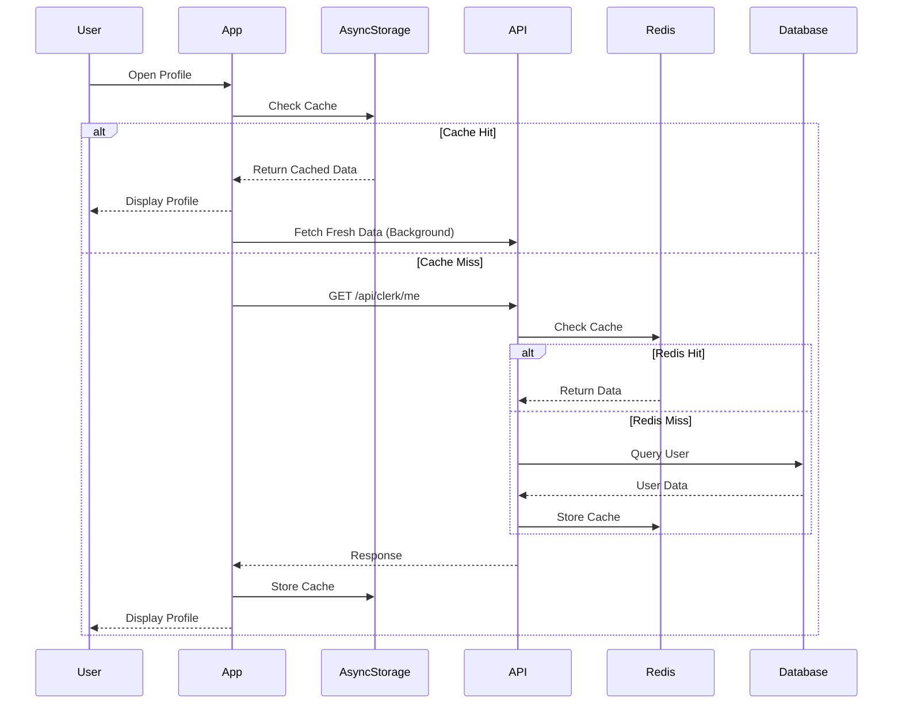
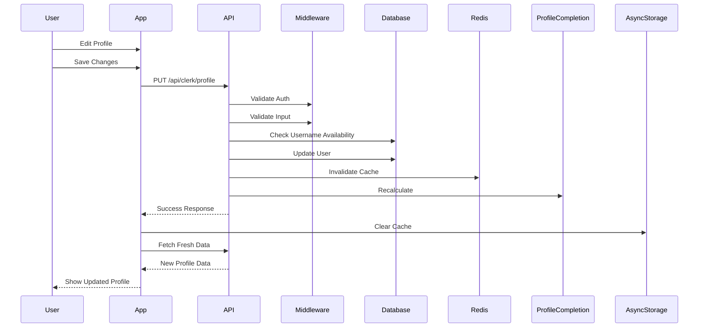
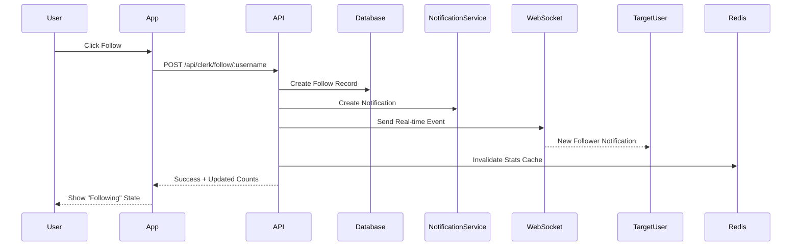

# 🏗️ التخطيط الهندسي الكامل لنظام البروفايل - 90Plus

## 📋 نظرة عامة

نظام البروفايل في 90Plus مبني على معمارية ثلاثية الطبقات مع caching متعدد المستويات لضمان الأداء العالي.

---

## 🎯 رحلة المستخدم (User Journey)

### 1️⃣ فتح البروفايل
```
المستخدم يفتح التطبيق
    ↓
يضغط على أيقونة البروفايل
    ↓
التطبيق يطلب البيانات
    ↓
يعرض البروفايل
```

### 2️⃣ تعديل البروفايل
```
المستخدم يضغط "تعديل"
    ↓
يغير البيانات (اسم، صورة، bio)
    ↓
يضغط "حفظ"
    ↓
التطبيق يرسل للسيرفر
    ↓
السيرفر يحدث البيانات
    ↓
يمسح الـ cache
    ↓
يرجع البيانات الجديدة
```

---

## 🔧 المعمارية التقنية (Technical Architecture)

### 📱 Frontend Layer (React Native)

#### المكونات الرئيسية:
```
front/
├── app/(tabs)/profile.tsx              # شاشة البروفايل الرئيسية
├── components/profile/
│   ├── ProfileCompletionCardFixed.tsx  # كارت نسبة اكتمال البروفايل
│   └── FollowersListModal.tsx          # قائمة المتابعين
├── hooks/
│   ├── useProfileCompletion.ts         # حساب نسبة الاكتمال
│   └── useProfileCache.ts              # إدارة الـ cache المحلي
└── contexts/
    └── LanguageContext.tsx             # دعم اللغات المتعددة
```

#### تدفق البيانات في Frontend:
```
1. Component Mount
   ↓
2. useProfileCache Hook
   ↓
3. Check Local Cache (AsyncStorage)
   ↓
4. If Not Found → API Call
   ↓
5. Store in Cache
   ↓
6. Render UI
```

---

### 🖥️ Backend Layer (Node.js + Express)

#### الهيكل:
```
Backend/src/
├── routes/
│   └── clerk-user.routes.ts           # جميع endpoints البروفايل
├── controllers/
│   └── profile.controller.ts          # Business logic
├── services/
│   ├── clerk-user.service.ts          # تكامل مع Clerk Auth
│   ├── profile-cache.service.ts       # Redis cache للبروفايلات
│   ├── redis-cache.service.ts         # Redis cache عام
│   └── profile-completion.service.ts  # حساب نسبة الاكتمال
├── middleware/
│   ├── clerk.middleware.ts            # Authentication
│   └── rateLimit.middleware.ts        # Rate limiting
└── lib/
    ├── prisma.ts                      # Database client
    └── redis.ts                       # Redis client
```

---

## 🔌 API Endpoints

### 1. GET /api/clerk/me
**الوظيفة:** جلب بيانات المستخدم الحالي

**Flow:**
```
Request → Auth Middleware → Check Redis Cache
    ↓ (Cache Miss)
Database Query → Format Data → Store in Cache → Response
```

**Response:**
```json
{
  "status": "SUCCESS",
  "data": {
    "user": {
      "id": "user_123",
      "username": "mohamed_salah",
      "displayName": "Mohamed Salah",
      "avatar": "https://...",
      "coins": 1500,
      "level": 12,
      "xp": 3400,
      "favoriteTeam": "Liverpool",
      "position": "RW",
      "followers": 1234,
      "following": 567
    }
  }
}
```

**Cache Strategy:**
- TTL: 5 minutes
- Key: `profile:${clerkUserId}`
- Invalidation: عند أي تحديث للبروفايل

---

### 2. PUT /api/clerk/profile
**الوظيفة:** تحديث البيانات الأساسية

**Validation:**
- Username: lowercase, alphanumeric + underscore
- Username change: مرة كل 15 يوم
- Bio: max 500 characters

**Flow:**
```
Request → Auth → Validate Input
    ↓
Check Username Availability
    ↓
Check Last Username Change (15 days rule)
    ↓
Update Database
    ↓
Invalidate Cache
    ↓
Recalculate Profile Completion
    ↓
Response
```

---

### 3. PUT /api/clerk/card-profile
**الوظيفة:** تحديث بيانات الكارت (FIFA-style)

**Fields:**
- position: GK, CB, LB, RB, CDM, CM, CAM, LM, RM, LW, RW, ST, CF
- countryFlag: emoji flag
- age, height, weight
- preferredFoot: R, L, B
- clubLogo, brandLogo

---

### 4. POST /api/clerk/follow/:username
**الوظيفة:** متابعة مستخدم

**Flow:**
```
Request → Auth → Get Current User
    ↓
Get Target User by Username
    ↓
Check Not Following Self
    ↓
Check Not Already Following
    ↓
Create Follow Record
    ↓
Send Notification (WebSocket + Database)
    ↓
Update Follower Counts
    ↓
Response
```

**WebSocket Event:**
```javascript
{
  event: 'follow',
  data: {
    followerId: "user_123",
    followerUsername: "mohamed_salah",
    action: "follow"
  }
}
```

---

### 5. GET /api/clerk/search?q=mohamed
**الوظيفة:** البحث عن مستخدمين

**Ranking Algorithm:**
```javascript
Score Calculation:
- Exact username match: +1000
- Username starts with query: +500
- Username contains query: +200
- Exact displayName match: +800
- DisplayName starts with query: +400
- DisplayName contains query: +150
- Verified badge: +100
- User level: +level
```

**Cache:**
- Key: `search:${query}:${limit}`
- TTL: 2 minutes

---

### 6. GET /api/clerk/user/:username
**الوظيفة:** جلب بروفايل مستخدم آخر

**Returns:**
- User basic info
- Stats (followers, following, reels count)
- isFollowing (هل أنا بتابعه)
- isFollowingMe (هل هو بيتابعني)

---

### 7. GET /api/clerk/followers/:userId
**الوظيفة:** قائمة المتابعين

**Features:**
- Pagination (limit, offset)
- Shows if current user follows each follower
- Sorted by recent first

---

### 8. GET /api/clerk/following/:userId
**الوظيفة:** قائمة المتابَعين

---

### 9. PUT /api/clerk/social-links
**الوظيفة:** تحديث روابط السوشيال ميديا

**Validation:**
- Max 5 links
- Allowed platforms: instagram, twitter, facebook, youtube, tiktok, website, linkedin, snapchat
- Auto-add https:// if missing

---

### 10. GET /api/clerk/username-change-status
**الوظيفة:** التحقق من إمكانية تغيير Username

**Returns:**
```json
{
  "canChange": false,
  "lastChange": "2024-01-01T00:00:00Z",
  "nextAllowedChange": "2024-01-16T00:00:00Z",
  "daysRemaining": 5
}
```

---

## 💾 Caching Strategy (استراتيجية الـ Cache)

### 3-Layer Caching:

#### 1️⃣ Frontend Cache (AsyncStorage)
```
Location: Mobile Device
TTL: 10 minutes
Purpose: Offline support + instant load
```

#### 2️⃣ Redis Cache (Server)
```
Location: Redis Server
TTL: 5 minutes (profiles), 2 minutes (search)
Purpose: Reduce database load
```

#### 3️⃣ Database (PostgreSQL)
```
Location: Primary Database
Purpose: Source of truth
```

### Cache Keys Structure:
```
profile:{clerkUserId}           # User profile data
search:{query}:{limit}          # Search results
user:stats:{userId}             # User statistics
followers:{userId}:{offset}     # Followers list
following:{userId}:{offset}     # Following list
```

### Cache Invalidation:
```
Profile Update → Invalidate:
  - profile:{clerkUserId}
  - user:stats:{userId}
  - search:* (if username changed)

Follow/Unfollow → Invalidate:
  - user:stats:{followerId}
  - user:stats:{followingId}
  - followers:{followingId}:*
  - following:{followerId}:*
```

---

## 🔄 Data Flow (تدفق البيانات)

### Scenario 1: User Opens Profile



### Scenario 2: User Updates Profile



### Scenario 3: User Follows Another User



---

## 🗄️ Database Schema

### User Table (Prisma)
```prisma
model User {
  id                    String    @id @default(cuid())
  clerkUserId           String    @unique
  email                 String    @unique
  username              String    @unique
  displayName           String?
  avatar                String?
  coverImage            String?
  bio                   String?
  
  // Gamification
  coins                 Int       @default(0)
  level                 Int       @default(1)
  xp                    Int       @default(0)
  
  // Profile Card (FIFA-style)
  position              String?
  countryFlag           String?
  country               String?
  age                   Int?
  height                Int?
  weight                Int?
  preferredFoot         String?
  clubLogo              String?
  brandLogo             String?
  favoriteTeam          String?
  
  // Social
  socialLinks           Json?
  isVerified            Boolean   @default(false)
  isDeveloper           Boolean   @default(false)
  
  // Username Change Tracking
  lastUsernameChange    DateTime?
  
  // Timestamps
  createdAt             DateTime  @default(now())
  updatedAt             DateTime  @updatedAt
  
  // Relations
  followers             Follow[]  @relation("UserFollowers")
  following             Follow[]  @relation("UserFollowing")
  reels                 Reel[]
  notifications         Notification[]
}
```

### Follow Table
```prisma
model Follow {
  id          String   @id @default(cuid())
  followerId  String
  followingId String
  createdAt   DateTime @default(now())
  
  follower    User     @relation("UserFollowing", fields: [followerId], references: [id])
  following   User     @relation("UserFollowers", fields: [followingId], references: [id])
  
  @@unique([followerId, followingId])
  @@index([followerId])
  @@index([followingId])
}
```

---

## 🔐 Security & Validation

### Authentication Flow:
```
1. User logs in via Clerk
2. Clerk issues JWT token
3. Frontend stores token
4. Every API request includes token in header
5. clerk.middleware validates token
6. Extracts userId from token
7. Proceeds to route handler
```

### Rate Limiting:
```javascript
// User sync endpoint
userSyncLimiter: 10 requests / 15 minutes

// General endpoints
lenientLimiter: 100 requests / 15 minutes

// Write operations
writeLimiter: 30 requests / 15 minutes
```

### Input Validation:
- Username: 3-20 chars, lowercase, alphanumeric + underscore
- Bio: max 500 chars
- Social links: max 5, valid URLs
- Position: must be in allowed list
- Preferred foot: R, L, or B only

---

## 📊 Performance Optimizations

### 1. Database Indexes
```sql
CREATE INDEX idx_user_username ON User(username);
CREATE INDEX idx_user_clerk_id ON User(clerkUserId);
CREATE INDEX idx_follow_follower ON Follow(followerId);
CREATE INDEX idx_follow_following ON Follow(followingId);
```

### 2. Query Optimization
- Use `select` to fetch only needed fields
- Batch queries with `Promise.all()`
- Use `_count` for counting relations

### 3. Caching Strategy
- Profile data: 5 min TTL
- Search results: 2 min TTL
- Stats: 5 min TTL
- Invalidate on mutations

### 4. Frontend Optimization
- AsyncStorage for offline support
- Optimistic UI updates
- Background data refresh
- Image lazy loading

---

## 🔔 Real-time Features (WebSocket)

### Events:
```javascript
// Follow Event
{
  event: 'follow',
  userId: 'target_user_id',
  data: {
    followerId: 'follower_id',
    followerUsername: 'username',
    action: 'follow' | 'unfollow'
  }
}

// Notification Event
{
  event: 'notification',
  userId: 'user_id',
  data: {
    type: 'FOLLOW',
    title: 'متابع جديد',
    message: 'محمد صلاح بدأ متابعتك',
    actorId: 'actor_id'
  }
}
```

---

## 🧪 Testing Strategy

### Unit Tests:
- `useProfileCompletion.test.ts` - Profile completion calculation
- `usePerformanceMonitor.test.ts` - Performance monitoring

### Integration Tests:
- API endpoint testing
- Database operations
- Cache invalidation

### E2E Tests:
- User registration flow
- Profile update flow
- Follow/unfollow flow

---

## 📈 Monitoring & Analytics

### Metrics to Track:
- Profile load time (target: <500ms)
- Cache hit rate (target: >80%)
- API response time (target: <200ms)
- Error rate (target: <1%)
- Follow/unfollow success rate

### Logging:
```javascript
logger.info('Profile loaded', { userId, loadTime });
logger.warn('Cache miss', { key, reason });
logger.error('Profile update failed', { userId, error });
```

---

## 🚀 Deployment Architecture

```
User Device (Mobile App)
    ↓ HTTPS
Load Balancer (Railway)
    ↓
Backend Servers (Node.js)
    ↓
├─→ PostgreSQL (Primary DB)
├─→ Redis (Cache Layer)
├─→ Clerk (Auth Service)
└─→ Supabase/R2 (Media Storage)
```

---

## 🔮 Future Enhancements

1. **Profile Analytics Dashboard**
   - Profile views tracking
   - Engagement metrics
   - Growth charts

2. **Advanced Search**
   - Filter by position, country, level
   - Fuzzy search
   - Search history

3. **Profile Themes**
   - Custom color schemes
   - Premium themes
   - Seasonal themes

4. **Achievements System**
   - Profile completion badges
   - Social milestones
   - Special achievements

5. **Profile Verification**
   - Identity verification
   - Professional player verification
   - Influencer verification

---

## 📞 Support & Maintenance

### Common Issues:

**Issue 1: Profile not loading**
- Check: Auth token validity
- Check: Redis connection
- Check: Database connection
- Fallback: Return cached data

**Issue 2: Username change blocked**
- Check: Last change date
- Calculate: Days remaining
- Show: Clear error message

**Issue 3: Cache inconsistency**
- Solution: Manual cache invalidation
- Command: `redis-cli FLUSHDB`
- Prevention: Proper invalidation logic

---

## 👥 Team Responsibilities

### Backend Team:
- API endpoint maintenance
- Database optimization
- Cache strategy
- Security updates

### Frontend Team:
- UI/UX improvements
- Performance optimization
- Offline support
- Error handling

### DevOps Team:
- Server monitoring
- Redis management
- Database backups
- Deployment automation

---

## 📚 Documentation Links

- API Documentation: `/docs/api`
- Database Schema: `/prisma/schema.prisma`
- Frontend Components: `/front/components/profile`
- Testing Guide: `/docs/testing.md`

---

**Last Updated:** 2024
**Version:** 2.0
**Maintained by:** 90Plus Engineering Team
